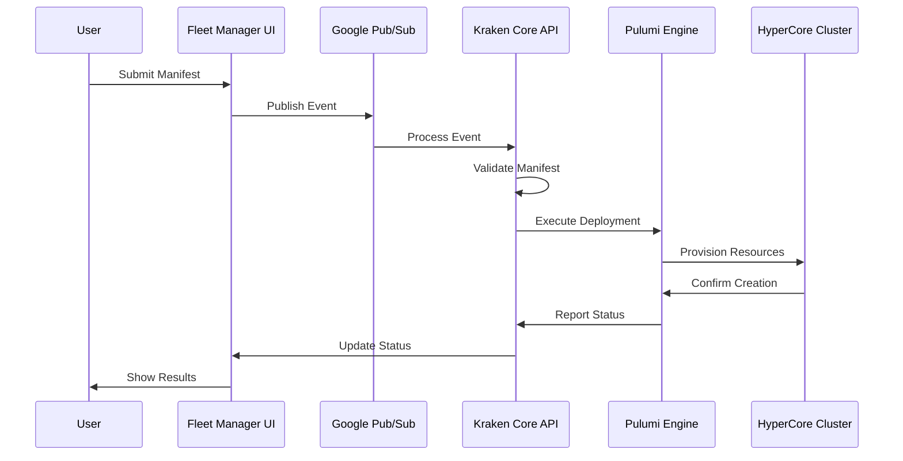

# Getting Started Overview

Welcome to Kraken Applications! This guide will help you understand the fundamentals of deploying applications using Kraken's infrastructure automation platform.

## What You'll Learn

In this getting started section, you'll discover:

- How Kraken Applications work
- The anatomy of a Kraken manifest
- How to deploy your first application
- Common patterns and best practices
- Troubleshooting tips

## Prerequisites

Before you begin, ensure you have:

- Access to a Scale Computing HyperCore environment
- Basic understanding of YAML syntax
- Familiarity with virtualization concepts
- (Optional) Experience with cloud-init for advanced configurations

## Core Concepts

### Kraken Manifests

Kraken manifests are YAML files that declaratively define your infrastructure. They specify:

- **Virtual machines** and their configurations
- **Assets** like disk images and ISOs
- **Network** and storage configurations
- **Initialization** scripts and cloud-init data

### Deployment Workflow



### Key Components

#### 1. Metadata
Every manifest includes metadata that describes your application:

```yaml
metadata:
  name: "my-application"
  labels:
    - "environment:production"
    - "team:platform"
```

#### 2. Assets
Assets define external resources like disk images:

```yaml
assets:
  - name: "ubuntu-image"
    type: "virtual_disk"
    format: "raw"
    url: "https://example.com/ubuntu.img"
```

#### 3. Resources
Resources define the actual infrastructure components:

```yaml
resources:
  - type: "virdomain"
    name: "web-server"
    spec:
      cpu: 2
      memory: "4294967296"
      state: "running"
```

## Manifest Structure

Every Kraken manifest follows this structure:

```yaml
type: Application              # Always "Application"
version: "1.0.0"              # Schema version
metadata:                     # Application metadata
  name: "app-name"
  labels: []
spec:                         # Main specification
  assets: []                  # External resources
  resources: []               # Infrastructure components
```

## Development Environment

For the best development experience, we recommend:

1. **YAML Editor**: Use an editor with YAML syntax highlighting
2. **Validation**: Set up schema validation for immediate feedback
3. **Version Control**: Track your manifests in Git
4. **Documentation**: Keep README files with your manifests

## Common Patterns

### Template Variables

Use template variables for dynamic values:

```yaml
metadata:
  name: "app-{{ app_id }}"
```

### Resource Tagging

Tag resources for organization:

```yaml
tags:
  - "production"
  - "web-tier"
  - "team:platform"
```

### State Management

Control VM lifecycle with state:

```yaml
state: "running"    # Start the VM
state: "shutoff"    # Stop the VM (useful for templates)
```

## Next Steps

Now that you understand the basics, you can:

1. **[Try the Quick Start](quickstart.md)** - Deploy your first application
2. **[Explore Examples](../examples/basic.md)** - See real-world use cases
3. **[Read the Specification](../spec/overview.md)** - Deep dive into the API
4. **[Learn Best Practices](../best-practices/general.md)** - Optimize your deployments

## Getting Help

If you need assistance:

- Check our [Troubleshooting Guide](../best-practices/troubleshooting.md)
- Browse [Examples](../examples/basic.md) for similar use cases
- Review the [API Reference](../api/core.md) for technical details
- Open an issue on [GitHub](https://github.com/jackhall/kraken-applications/issues)

Ready to dive in? Let's start with the [Quick Start Guide](quickstart.md)!