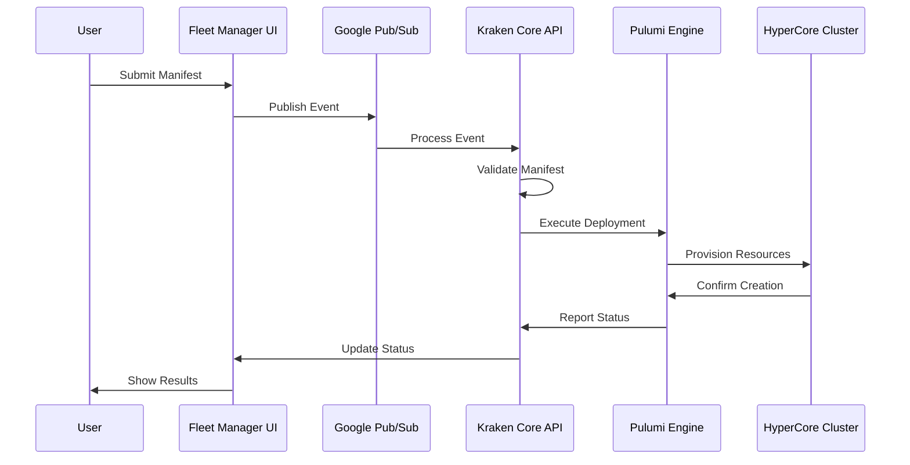

# Kraken Applications

Welcome to the comprehensive documentation for **Kraken Applications** – a collection of reference manifests and interactive guides for deploying virtual machines and applications using the Kraken infrastructure automation platform.

## What is Kraken?

Kraken is an infrastructure automation platform that simplifies the deployment and management of virtual machines on Scale Computing's HyperCore infrastructure. Using declarative YAML manifests, Kraken enables you to define, version, and deploy complete application stacks with ease.

## Key Features

- **Declarative Infrastructure**: Define your entire infrastructure as code using YAML manifests
- **Template-Based Deployment**: Leverage proven templates for common deployment patterns
- **Multi-VM Applications**: Deploy complex applications spanning multiple virtual machines
- **Cloud-Init Integration**: Automated VM initialization and configuration
- **Asset Management**: Centralized management of disk images and other resources
- **Production Ready**: Battle-tested manifests used in production environments

## How It Works

## Quick Start

Get started with Kraken Applications in just a few steps:

1. **[Browse Examples](examples/basic.md)** - Explore ready-to-use manifest templates
2. **[Read the Specification](spec/overview.md)** - Understand the manifest format
3. **[Deploy Your First App](getting-started/quickstart.md)** - Follow our quick start guide
4. **[Learn Best Practices](best-practices/general.md)** - Optimize your deployments

## Documentation Structure

This documentation is organized into several sections:

- **[Getting Started](getting-started/overview.md)** - Introduction and setup guides
- **[Manifest Specification](spec/overview.md)** - Complete API reference
- **[Examples](examples/basic.md)** - Real-world deployment examples
- **[Best Practices](best-practices/general.md)** - Optimization and security guides
- **[Manifest Specification](spec/overview.md)** - Technical specification documentation

## Community and Support

- **GitHub**: [kraken-applications](https://github.com/scalecomputing/kraken-applications)
- **Issues**: Report bugs and request features via slack at #kraken-users
- **Contributing**: [Help improve the documentation] (https://github.com/ScaleComputing/kraken-applications/issues)

---

**Ready to get started?** Head over to our [Quick Start Guide](getting-started/quickstart.md) to deploy your first Kraken application.
